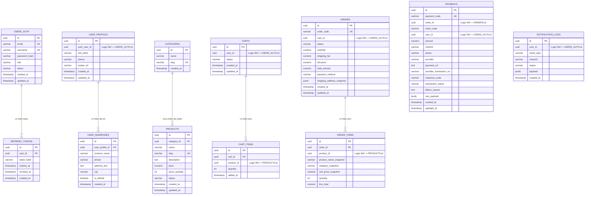
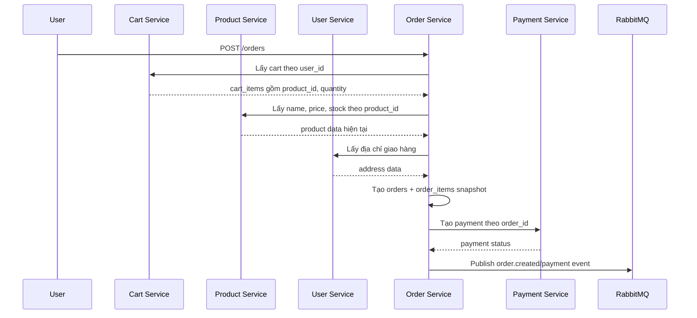

# Thiết Kế Cơ Sở Dữ Liệu

## 1. Mục Tiêu Thiết Kế

File này mô tả rõ dữ liệu của hệ thống, bao gồm:

- Mỗi service sở hữu database nào.
- Bảng nào chứa dữ liệu gì.
- Trường nào là khóa chính.
- Trường nào là khóa ngoại vật lý.
- Trường nào chỉ là tham chiếu logic giữa các service.
- Vì sao cần thiết kế như vậy.

Điểm quan trọng trong microservices: mỗi service nên sở hữu dữ liệu riêng. Service khác không được truy cập trực tiếp database của service đó, mà phải đi qua API hoặc event.

## 2. Quy Ước Khóa Và Liên Kết

| Ký hiệu | Ý nghĩa |
| --- | --- |
| PK | Primary Key, khóa chính của bảng |
| FK | Foreign Key vật lý trong cùng database |
| UK | Unique Key, giá trị không được trùng |
| Logic Ref | Tham chiếu logic sang dữ liệu của service khác, không tạo FK vật lý |
| Snapshot | Bản chụp dữ liệu tại thời điểm phát sinh nghiệp vụ |

Ví dụ:

- `refresh_tokens.user_id` là FK thật đến `users_auth.id` vì cùng `auth-db`.
- `orders.user_id` là Logic Ref đến `users_auth.id` vì `orders` nằm trong `order-db`, không cùng database với `auth-db`.
- `order_items.product_name_snapshot` là Snapshot để giữ lại tên sản phẩm tại thời điểm đặt hàng, kể cả sau này sản phẩm đổi tên.

## 3. Tổng Quan Database Theo Service

| Service | Database | Bảng chính | Mục đích |
| --- | --- | --- | --- |
| Auth Service | auth-db | `users_auth`, `refresh_tokens` | Xác thực, đăng nhập, token |
| User Service | user-db | `user_profiles`, `user_addresses` | Hồ sơ và địa chỉ người dùng |
| Product Service | product-db | `categories`, `products` | Danh mục, sản phẩm, tồn kho |
| Cart Service | cart-db | `carts`, `cart_items` | Giỏ hàng tạm thời |
| Order Service | order-db | `orders`, `order_items` | Đơn hàng và chi tiết đơn hàng |
| Payment Service | payment-db | `payments` | Giao dịch thanh toán COD/VNPAY |
| Notification Service | notification-db | `notification_logs` | Lịch sử thông báo, optional |

## 4. Sơ Đồ Quan Hệ Dữ Liệu

Sơ đồ dưới đây thể hiện cả quan hệ vật lý trong cùng database và tham chiếu logic giữa các service.

## 5. Bảng Liên Kết Giữa Các Trường

Đây là phần quan trọng nhất khi đọc database. Nó cho biết trường nào nối với trường nào.

| Từ bảng.trường | Đến bảng.trường | Loại liên kết | Ý nghĩa |
| --- | --- | --- | --- |
| `refresh_tokens.user_id` | `users_auth.id` | FK vật lý | Một user có thể có nhiều refresh token |
| `user_profiles.auth_user_id` | `users_auth.id` | Logic Ref | Profile thuộc về một tài khoản auth |
| `user_addresses.user_profile_id` | `user_profiles.id` | FK vật lý | Một profile có nhiều địa chỉ |
| `products.category_id` | `categories.id` | FK vật lý | Một category có nhiều product |
| `carts.user_id` | `users_auth.id` | Logic Ref | Một user có một hoặc nhiều cart theo trạng thái |
| `cart_items.cart_id` | `carts.id` | FK vật lý | Một cart có nhiều item |
| `cart_items.product_id` | `products.id` | Logic Ref | Item trong giỏ tham chiếu đến product |
| `orders.user_id` | `users_auth.id` | Logic Ref | Đơn hàng thuộc về một user |
| `order_items.order_id` | `orders.id` | FK vật lý | Một order có nhiều item |
| `order_items.product_id` | `products.id` | Logic Ref | Item trong đơn tham chiếu product gốc |
| `payments.order_id` | `orders.id` | Logic Ref | Payment thanh toán cho một order |
| `notification_logs.user_id` | `users_auth.id` | Logic Ref | Notification gửi cho một user |

## 6. Database Auth

Auth Service chịu trách nhiệm xác thực. Các service khác không được đọc trực tiếp `auth-db`.

Trong lát triển khai hiện tại, `auth-db` đã được code bằng PostgreSQL init SQL tại `apps/auth-service/db/init/001-create-schema.sql`.
Refresh token không lưu plain text trong DB; service chỉ lưu `token_hash`.

### 6.1 Bảng `users_auth`

| Trường | Kiểu | Khóa/Ràng buộc | Liên kết | Mục đích |
| --- | --- | --- | --- | --- |
| `id` | uuid | PK | Được service khác tham chiếu logic | Định danh tài khoản |
| `email` | varchar | UK, not null | Không | Email đăng nhập |
| `username` | varchar | UK, not null | Không | Tên đăng nhập |
| `password_hash` | varchar | not null | Không | Mật khẩu đã hash |
| `role` | varchar | not null | Không | Phân quyền: customer/admin |
| `status` | varchar | not null | Không | Trạng thái: active/blocked |
| `created_at` | timestamp | not null | Không | Thời điểm tạo |
| `updated_at` | timestamp | not null | Không | Thời điểm cập nhật |

Liên kết nghiệp vụ:

- Một `users_auth.id` có thể được tham chiếu bởi `user_profiles.auth_user_id`.
- Một `users_auth.id` có thể được tham chiếu bởi `carts.user_id`, `orders.user_id`, `notification_logs.user_id`.
- Các liên kết này là Logic Ref vì nằm ở database khác.

### 6.2 Bảng `refresh_tokens`

| Trường | Kiểu | Khóa/Ràng buộc | Liên kết | Mục đích |
| --- | --- | --- | --- | --- |
| `id` | uuid | PK | Không | Định danh token |
| `user_id` | uuid | FK, not null | `users_auth.id` | Token thuộc về user nào |
| `token_hash` | varchar | not null | Không | Hash của refresh token |
| `expires_at` | timestamp | not null | Không | Thời điểm hết hạn |
| `revoked_at` | timestamp | nullable | Không | Thời điểm token bị thu hồi |
| `created_at` | timestamp | not null | Không | Thời điểm tạo |

Quan hệ:

- `users_auth.id` 1-n `refresh_tokens.user_id`.
- Một user có thể có nhiều refresh token vì đăng nhập trên nhiều thiết bị.

## 7. Database User

User Service quản lý dữ liệu hồ sơ, tách khỏi Auth Service để Auth chỉ tập trung vào xác thực.

Trong lát triển khai hiện tại, `user-db` đã được code bằng PostgreSQL init SQL tại `apps/user-service/db/init/001-create-schema.sql`.
User Service tự tạo profile lần đầu khi user đã đăng nhập gọi `GET /users/me`.

### 7.1 Bảng `user_profiles`

| Trường | Kiểu | Khóa/Ràng buộc | Liên kết | Mục đích |
| --- | --- | --- | --- | --- |
| `id` | uuid | PK | Được `user_addresses.user_profile_id` tham chiếu | Định danh profile |
| `auth_user_id` | uuid | UK, Logic Ref | `users_auth.id` | Gắn profile với tài khoản auth |
| `full_name` | varchar | nullable | Không | Họ tên |
| `phone` | varchar | nullable | Không | Số điện thoại |
| `avatar_url` | varchar | nullable | Không | Ảnh đại diện |
| `created_at` | timestamp | not null | Không | Thời điểm tạo |
| `updated_at` | timestamp | not null | Không | Thời điểm cập nhật |

Quan hệ:

- `user_profiles.auth_user_id` nên unique để mỗi tài khoản auth chỉ có một profile chính.
- Đây là Logic Ref, không phải FK vật lý, vì `users_auth` nằm trong `auth-db`.

### 7.2 Bảng `user_addresses`

| Trường | Kiểu | Khóa/Ràng buộc | Liên kết | Mục đích |
| --- | --- | --- | --- | --- |
| `id` | uuid | PK | Không | Định danh địa chỉ |
| `user_profile_id` | uuid | FK, not null | `user_profiles.id` | Địa chỉ thuộc profile nào |
| `receiver_name` | varchar | not null | Không | Tên người nhận |
| `phone` | varchar | not null | Không | SĐT người nhận |
| `address_line` | text | not null | Không | Địa chỉ chi tiết |
| `city` | varchar | not null | Không | Thành phố |
| `is_default` | boolean | default false | Không | Có phải địa chỉ mặc định không |
| `created_at` | timestamp | not null | Không | Thời điểm tạo |

Quan hệ:

- `user_profiles.id` 1-n `user_addresses.user_profile_id`.
- Một user có thể có nhiều địa chỉ giao hàng.
- Nên đảm bảo mỗi profile chỉ có một địa chỉ mặc định bằng logic trong service hoặc unique partial index.

## 8. Database Product

Product Service quản lý dữ liệu sản phẩm và danh mục.

Trong lát triển khai hiện tại, `product-db` đã được code bằng PostgreSQL init SQL tại `apps/product-service/db/init/`.
Các id đang dùng kiểu `text` như `prod-oat-honey`, `cat-grains` để giữ ổn định với API/frontend hiện tại.

### 8.1 Bảng `categories`

| Trường | Kiểu | Khóa/Ràng buộc | Liên kết | Mục đích |
| --- | --- | --- | --- | --- |
| `id` | text | PK | Được `products.category_id` tham chiếu | Định danh danh mục |
| `name` | varchar | not null | Không | Tên danh mục |
| `slug` | varchar | UK, not null | Không | Đường dẫn thân thiện |
| `created_at` | timestamp | not null | Không | Thời điểm tạo |

### 8.2 Bảng `products`

| Trường | Kiểu | Khóa/Ràng buộc | Liên kết | Mục đích |
| --- | --- | --- | --- | --- |
| `id` | text | PK | Được cart/order tham chiếu logic | Định danh sản phẩm |
| `category_id` | text | FK, not null | `categories.id` | Sản phẩm thuộc danh mục nào |
| `name` | varchar | not null | Không | Tên sản phẩm |
| `slug` | varchar | UK, not null | Không | Đường dẫn thân thiện |
| `description` | text | nullable | Không | Mô tả sản phẩm |
| `price` | numeric | not null | Không | Giá hiện tại |
| `old_price` | numeric | nullable | Không | Giá cũ để hiển thị khuyến mãi |
| `stock_quantity` | int | not null | Không | Số lượng tồn kho |
| `unit` | varchar | not null | Không | Đơn vị bán |
| `badge` | varchar | not null | Không | Nhãn hiển thị như Hot/Sale |
| `accent` | varchar | not null | Không | Màu nhấn cho UI |
| `status` | varchar | not null | Không | active/inactive |
| `created_at` | timestamp | not null | Không | Thời điểm tạo |
| `updated_at` | timestamp | not null | Không | Thời điểm cập nhật |

Quan hệ:

- `categories.id` 1-n `products.category_id`.
- `cart_items.product_id` và `order_items.product_id` là Logic Ref đến `products.id`.
- Order vẫn cần lưu snapshot tên và giá sản phẩm để lịch sử đơn hàng không bị thay đổi khi product đổi giá/tên.

## 9. Database Cart

Cart Service quản lý giỏ hàng tạm thời.

Trong lát triển khai hiện tại, Cart Service dùng PostgreSQL và đã có init SQL tại `apps/cart-service/db/init/001-create-schema.sql`.

Lưu ý microservices: `cart-db` không tạo FK thật sang `product-db` hoặc `auth-db`. Vì vậy `carts.user_id` và `cart_items.product_id` là Logic Ref.

### 9.1 Nếu Sau Này Dùng Redis

| Thành phần | Ví dụ | Ý nghĩa |
| --- | --- | --- |
| Key | `cart:{user_id}` | Giỏ hàng của một user |
| Value | JSON/list | Danh sách `product_id`, `quantity`, `added_at` |
| TTL | optional | Tự xóa giỏ hàng cũ |

### 9.2 Nếu Dùng PostgreSQL: Bảng `carts`

| Trường | Kiểu | Khóa/Ràng buộc | Liên kết | Mục đích |
| --- | --- | --- | --- | --- |
| `id` | uuid | PK | Được `cart_items.cart_id` tham chiếu | Định danh giỏ hàng |
| `user_id` | uuid | Logic Ref, not null | `users_auth.id` | Giỏ hàng thuộc user nào |
| `status` | varchar | not null | Không | active/checked_out |
| `created_at` | timestamp | not null | Không | Thời điểm tạo |
| `updated_at` | timestamp | not null | Không | Thời điểm cập nhật |

Ràng buộc quan trọng:

- Có partial unique index để mỗi user chỉ có một cart `active`.
- Khi user gọi `GET /cart`, service tự tạo cart active nếu chưa có.

### 9.3 Bảng `cart_items`

| Trường | Kiểu | Khóa/Ràng buộc | Liên kết | Mục đích |
| --- | --- | --- | --- | --- |
| `id` | uuid | PK | Không | Định danh item |
| `cart_id` | uuid | FK, not null | `carts.id` | Item thuộc giỏ hàng nào |
| `product_id` | text | Logic Ref, not null | `products.id` | Sản phẩm được thêm vào giỏ |
| `quantity` | int | not null | Không | Số lượng |
| `added_at` | timestamp | not null | Không | Thời điểm thêm |
| `updated_at` | timestamp | not null | Không | Thời điểm cập nhật số lượng |

Quan hệ:

- `carts.id` 1-n `cart_items.cart_id`.
- `cart_items.product_id` chỉ lưu product id, không lưu giá chính thức.
- Một cart không được có hai dòng trùng cùng `product_id`; nếu add lại thì tăng `quantity`.
- Khi tạo order, Order Service gọi Product Service để lấy giá hiện tại và lưu snapshot.

## 10. Database Order

Order Service là nơi lưu lịch sử giao dịch mua hàng. Đây là dữ liệu cần ổn định, không bị thay đổi bởi dữ liệu product/profile sau này.

Trong lát triển khai hiện tại, `order-db` đã được code bằng PostgreSQL init SQL tại `apps/order-service/db/init/001-create-schema.sql`.
Order Service tạo mã đơn public dạng `ORD-xxxxxx` trong trường `order_code`; còn `id` vẫn là UUID nội bộ để làm khóa chính.

### 10.1 Bảng `orders`

| Trường | Kiểu | Khóa/Ràng buộc | Liên kết | Mục đích |
| --- | --- | --- | --- | --- |
| `id` | uuid | PK | Được `order_items.order_id` tham chiếu | Định danh đơn hàng |
| `order_code` | varchar | UK, not null | Không | Mã đơn user nhìn thấy, ví dụ `ORD-892866` |
| `user_id` | uuid | Logic Ref, not null | `users_auth.id` | User tạo đơn hàng |
| `status` | varchar | not null | Không | created/paid/shipping/completed/cancelled |
| `subtotal` | numeric | not null | Không | Tổng tiền hàng trước phí ship/giảm giá |
| `shipping_fee` | numeric | not null | Không | Phí giao hàng |
| `discount` | numeric | not null | Không | Số tiền giảm giá |
| `total_amount` | numeric | not null | Không | Tổng tiền của đơn |
| `payment_method` | varchar | not null | Không | cod/vnpay |
| `shipping_address_snapshot` | jsonb | not null | Snapshot từ User Service | Địa chỉ tại thời điểm đặt hàng |
| `created_at` | timestamp | not null | Không | Thời điểm tạo |
| `updated_at` | timestamp | not null | Không | Thời điểm cập nhật |

### 10.2 Bảng `order_items`

| Trường | Kiểu | Khóa/Ràng buộc | Liên kết | Mục đích |
| --- | --- | --- | --- | --- |
| `id` | uuid | PK | Không | Định danh item trong đơn |
| `order_id` | uuid | FK, not null | `orders.id` | Item thuộc order nào |
| `product_id` | text | Logic Ref, not null | `products.id` | Sản phẩm gốc |
| `product_name_snapshot` | varchar | not null | Snapshot từ Product Service | Tên sản phẩm lúc đặt hàng |
| `category_snapshot` | varchar | not null | Snapshot từ Product Service | Danh mục sản phẩm lúc đặt hàng |
| `unit_price_snapshot` | numeric | not null | Snapshot từ Product Service | Giá sản phẩm lúc đặt hàng |
| `quantity` | int | not null | Không | Số lượng mua |
| `line_total` | numeric | not null | Không | `unit_price_snapshot * quantity` |

Quan hệ:

- `orders.id` 1-n `order_items.order_id`.
- `orders.subtotal` bằng tổng `order_items.line_total`.
- `orders.total_amount = subtotal + shipping_fee - discount`.
- Không tính lại đơn hàng dựa trên `products.price` sau khi order đã được tạo.

## 11. Database Payment

Payment Service lưu kết quả thanh toán và hiện đã tích hợp VNPAY sandbox ở mức tạo payment URL, verify Return URL và xử lý IPN.

Trong lát triển khai hiện tại, `payment-db` đã được code bằng PostgreSQL init SQL tại `apps/payment-service/db/init/001-create-schema.sql`.
Với VNPAY, trường quan trọng nhất để map giao dịch trả về là `payment_code`. Giá trị này được gửi sang VNPAY bằng `vnp_TxnRef`.

### Bảng `payments`

| Trường | Kiểu | Khóa/Ràng buộc | Liên kết | Mục đích |
| --- | --- | --- | --- | --- |
| `id` | uuid | PK | Không | Định danh payment |
| `payment_code` | varchar | UK, not null | Gửi sang VNPAY qua `vnp_TxnRef` | Mã payment attempt |
| `order_id` | uuid | Logic Ref, not null | `orders.id` | Payment thuộc order nào |
| `order_code` | varchar | not null | `orders.order_code` | Mã đơn như `ORD-xxxxxx` |
| `user_id` | uuid | Logic Ref, not null | `users_auth.id` | User sở hữu payment |
| `amount` | numeric | not null | Không | Số tiền thanh toán |
| `method` | varchar | not null | Không | cod/vnpay |
| `status` | varchar | not null | Không | pending/success/failed |
| `provider` | varchar | not null | Không | internal/vnpay |
| `payment_url` | text | nullable | Không | URL redirect sang VNPAY sandbox |
| `provider_transaction_no` | varchar | nullable | Không | Mã giao dịch tại VNPAY |
| `bank_code` | varchar | nullable | Không | Ngân hàng thanh toán |
| `bank_tran_no` | varchar | nullable | Không | Mã giao dịch ngân hàng |
| `card_type` | varchar | nullable | Không | Loại thẻ/tài khoản |
| `pay_date` | varchar | nullable | Không | Thời điểm thanh toán từ VNPAY |
| `response_code` | varchar | nullable | Không | `vnp_ResponseCode` |
| `transaction_status` | varchar | nullable | Không | `vnp_TransactionStatus` |
| `failure_reason` | text | nullable | Không | Lý do fail nếu có |
| `raw_payload` | jsonb | nullable | Không | Payload VNPAY trả về để debug |
| `created_at` | timestamp | not null | Không | Thời điểm tạo |
| `updated_at` | timestamp | not null | Không | Thời điểm cập nhật |

Quan hệ:

- `payments.order_id` là Logic Ref đến `orders.id`.
- `payments.user_id` là Logic Ref đến `users_auth.id`.
- Có thể cho một order có nhiều payment attempts nếu user thanh toán lại.
- Khi VNPAY IPN về, hệ thống kiểm tra checksum, tìm `payment_code = vnp_TxnRef`, kiểm tra `amount * 100 == vnp_Amount`, kiểm tra payment còn `pending`, rồi mới cập nhật `status`.

## 12. Database Notification Tùy Chọn

Notification Service có thể chỉ ghi log ra console trong MVP. Nếu muốn lưu lịch sử, dùng bảng sau.

### Bảng `notification_logs`

| Trường | Kiểu | Khóa/Ràng buộc | Liên kết | Mục đích |
| --- | --- | --- | --- | --- |
| `id` | uuid | PK | Không | Định danh notification |
| `user_id` | uuid | Logic Ref | `users_auth.id` | Người nhận thông báo |
| `event_type` | varchar | not null | Không | order_created/payment_success |
| `channel` | varchar | not null | Không | email/log |
| `status` | varchar | not null | Không | sent/failed |
| `payload` | jsonb | nullable | Không | Nội dung thông báo |
| `created_at` | timestamp | not null | Không | Thời điểm tạo |

## 13. Luồng Dữ Liệu Khi Tạo Đơn Hàng

Đây là luồng giúp hiểu tại sao các bảng liên kết như trên.

## 14. Vì Sao Cần Snapshot Trong Order

Không nên chỉ lưu `product_id` rồi mỗi lần xem đơn hàng lại lấy giá từ Product Service.

Lý do:

- Giá sản phẩm có thể thay đổi sau khi user mua.
- Tên sản phẩm có thể thay đổi.
- Địa chỉ user có thể sửa sau khi đặt hàng.
- Lịch sử đơn hàng phải phản ánh đúng thời điểm giao dịch.

Vì vậy `order_items` cần:

- `product_name_snapshot`
- `unit_price_snapshot`
- `subtotal`

Và `orders` cần:

- `shipping_address_snapshot`

## 15. Quy Tắc Cho Agent Khi Sửa Database

Khi Agent cần thêm bảng hoặc thêm cột:

1. Giải thích nghiệp vụ cần trường đó.
2. Xác định trường đó thuộc service nào.
3. Xác định đó là PK, FK vật lý, Logic Ref hay Snapshot.
4. Cập nhật file này trước khi tạo migration.
5. Không tạo foreign key vật lý sang database của service khác.
6. Nếu thêm field ảnh hưởng API/workflow, cập nhật `workflow.md`.
7. Nếu thêm service mới, cập nhật `workflow.md`.
