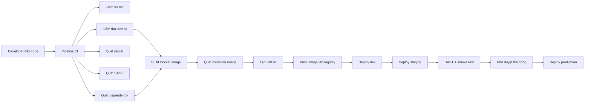

# Pipeline DevSecOps

## 1. Mục Tiêu Pipeline

Pipeline cần đảm bảo code mới được kiểm tra từ sớm, bao gồm:

- Kiểm tra chất lượng code.
- Chạy test tự động.
- Quét secret bị lộ.
- Quét lỗi bảo mật trong source code.
- Quét dependency có CVE.
- Build Docker image.
- Quét container image.
- Tạo SBOM.
- Deploy lên dev, staging, production theo từng gate.

## 2. Tổng Quan Luồng CI/CD

## 3. Chiến Lược Nhánh

| Nhánh/Tag | Pipeline | Mục đích |
| --- | --- | --- |
| feature/* | Chỉ CI | Lint, test, scan cơ bản |
| develop | CI + deploy dev | Test nhanh môi trường dev |
| main | CI + deploy staging | Kiểm thử trước release |
| v* tag | CI + approval + deploy prod | Phát hành production |

## 4. Giai Đoạn CI

### 4.1 Lấy Source Code

Lấy source code từ repository.

Công cụ:

- GitHub Actions `actions/checkout`

### 4.2 Cài Dependencies

Cài dependency cho từng service.

Công cụ tùy stack:

- Node.js: `npm ci`
- Go: `go mod download`
- Java: Maven/Gradle

### 4.3 Lint

Bắt lỗi style và lỗi code để thấy sớm.

Công cụ đề xuất:

- ESLint cho Node.js/React.
- golangci-lint cho Go.
- Checkstyle/SpotBugs cho Java.

### 4.4 Unit Test

Kiểm tra logic riêng từng service.

Công cụ đề xuất:

- Jest/Vitest cho Node.js.
- Go test cho Go.
- JUnit cho Java.

### 4.5 Quét Secret

Phát hiện secret bị commit vào source code.

Công cụ đề xuất:

- Gitleaks.
- TruffleHog optional.

Fail pipeline nếu phát hiện:

- API key.
- Password.
- Private key.
- Token.
- Cloud credential.

### 4.6 SAST

Static Application Security Testing. Quét source code để tìm bug bảo mật.

Công cụ đề xuất:

- Semgrep.
- SonarQube optional.

Ví dụ lỗi cần bắt:

- SQL injection.
- Hardcoded secret.
- Unsafe JWT handling.
- Missing input validation.
- Insecure crypto.

### 4.7 SCA

Software Composition Analysis. Quét dependency có CVE.

Công cụ đề xuất:

- OWASP Dependency-Check.
- npm audit.
- Snyk optional.
- Trivy filesystem scan.

## 5. Giai Đoạn Build

### 5.1 Build Docker Image

Mỗi service cần có Dockerfile riêng.

Image tag đề xuất:

- `service-name:commit-sha`
- `service-name:version`

Không dùng `latest` cho staging/prod.

### 5.2 Quét Container Image

Quét image sau khi build.

Công cụ đề xuất:

- Trivy.
- Grype optional.

Gate đề xuất:

- Fail nếu có CVE HIGH/CRITICAL chưa được chấp nhận.

### 5.3 Tạo SBOM

SBOM giúp biết image gồm những package nào.

Công cụ đề xuất:

- Syft.
- Trivy SBOM.

## 6. Giai Đoạn Registry

Nếu image đạt gate, push lên registry.

Công cụ/registry có thể dùng:

- Docker Hub.
- GitHub Container Registry.
- Harbor nếu muốn demo enterprise.

## 7. Giai Đoạn CD

### 7.1 Deploy Dev

Điều kiện kích hoạt:

- Push lên `develop`.

Mục đích:

- Test nhanh.
- Dữ liệu giả lập.
- Có thể dùng Docker Compose hoặc Kubernetes namespace `dev`.

### 7.2 Deploy Staging

Điều kiện kích hoạt:

- Merge vào `main`.

Mục đích:

- Gần giống production.
- Chạy smoke test.
- Chạy integration test.
- Chạy DAST.

### 7.3 Deploy Production

Điều kiện kích hoạt:

- Tạo release tag `v*`.

Yêu cầu:

- Manual approval.
- Image đã scan.
- Migration có kế hoạch rollback.
- Smoke test sau deploy.

## 8. Giai Đoạn DAST

Dynamic Application Security Testing. Quét ứng dụng đang chạy.

Công cụ đề xuất:

- OWASP ZAP baseline scan.

Chạy trên staging trước production.

Rủi ro cần bắt:

- Missing security headers.
- Reflected XSS cơ bản.
- Exposed sensitive endpoint.
- Insecure cookie config.

## 9. Monitoring Và Logging

### Metrics

Công cụ:

- Prometheus.
- Grafana.

Mỗi service cần expose:

- `/health`
- `/metrics`

### Logs

Công cụ:

- Loki + Promtail + Grafana.
- Hoặc ELK: Elasticsearch + Logstash/Fluentd + Kibana.

Log cần có:

- request id.
- user id nếu có.
- service name.
- status code.
- latency.
- error message.

## 10. Công Cụ Bảo Mật Đề Xuất

| Mục đích | Tool |
| --- | --- |
| Secret scan | Gitleaks |
| SAST | Semgrep |
| Dependency scan | OWASP Dependency-Check, npm audit, Trivy fs |
| Container scan | Trivy |
| SBOM | Syft hoặc Trivy |
| DAST | OWASP ZAP |
| Kubernetes policy | Kubesec, kube-score, OPA Gatekeeper optional |
| Runtime monitoring | Prometheus, Grafana |
| Log aggregation | Loki/Promtail hoặc ELK |

## 11. Cổng Kiểm Soát Chất Lượng

Pipeline nên fail nếu:

- Unit test failed.
- Secret scan phát hiện secret.
- SAST có lỗi high/critical.
- Container image có CVE critical.
- Docker build failed.
- Deploy staging failed.
- Smoke test failed.

## 12. Luật Cho Agent

Khi Agent thêm pipeline/tool:

- Giải thích tool dùng để bắt rủi ro nào.
- Cập nhật file này.
- Không thêm tool trùng lặp nếu không có lý do.
- Nếu thêm GitHub Actions workflow, phải ghi rõ trigger và job.
