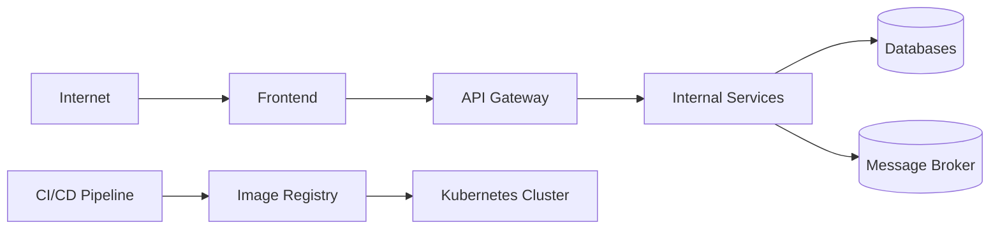

# Mô Hình Rủi Ro Bảo Mật

## 1. Mục Tiêu

File này mô tả các rủi ro bảo mật chính của hệ thống microservices và cách giảm thiểu. Threat model giúp DevSecOps pipeline không chỉ scan cho có, mà scan đúng những rủi ro cần quan tâm.

## 2. Tài Sản Cần Bảo Vệ

- Tài khoản người dùng.
- Password hash.
- Access token và refresh token.
- Thông tin cá nhân người dùng.
- Địa chỉ giao hàng.
- Dữ liệu đơn hàng.
- Secret của service.
- Database credentials.
- Container images.
- Kubernetes cluster.
- CI/CD credentials.

## 3. Biên Tin Cậy

Biên tin cậy quan trọng:

- Internet -> Frontend/API Gateway.
- API Gateway -> Internal services.
- Services -> Databases.
- CI/CD -> Registry/Kubernetes.

## 4. Rủi Ro Login

### Rủi ro

- Brute force password.
- Password yếu.
- Password lưu bằng plain text hoặc hash yếu.
- Login endpoint bị leak thông tin user tồn tại hay không.

### Giảm thiểu

- Hash password bằng bcrypt/argon2.
- Rate limit login.
- Response lỗi không tiết lộ user tồn tại hay không.
- Log login failed nhưng không log password.
- Thêm lockout hoặc captcha nếu cần.

### Công cụ liên quan

- Semgrep bắt insecure crypto.
- Unit test password hashing.
- OWASP ZAP test auth flow cơ bản.

## 5. Rủi Ro Token

### Rủi ro

- JWT secret bị commit lên git.
- Token hết hạn quá lâu.
- Refresh token lưu plain text.
- Frontend lưu token không an toàn.
- API Gateway verify token sai.

### Giảm thiểu

- Không commit JWT secret.
- Dùng secret manager hoặc Kubernetes Secret.
- Access token ngắn hạn.
- Refresh token lưu hash trong database.
- Verify issuer, audience, expiry.
- Không log token.

### Công cụ liên quan

- Gitleaks secret scan.
- Semgrep rule cho JWT misuse.
- Review API Gateway middleware.

## 6. Rủi Ro Database

### Rủi ro

- SQL injection.
- Database password hardcoded.
- Service truy cập database của service khác.
- Thiếu backup.
- Thiếu migration control.
- Dữ liệu nhạy cảm bị log ra ngoài.

### Giảm thiểu

- Dùng ORM/query parameterized.
- Secret nằm trong env/secret manager.
- Database per service.
- Principle of least privilege cho database user.
- Migration có review.
- Không log PII/password/token.

### Công cụ liên quan

- Semgrep SAST.
- Dependency scan cho ORM/database driver.
- Secret scan.

## 7. Rủi Ro Secret

### Rủi ro

- `.env` bị commit.
- Cloud credential bị commit.
- Docker registry token bị lộ.
- Kubernetes secret để plain text trong repo.

### Giảm thiểu

- Commit `.env.example`, không commit `.env`.
- Dùng GitHub Actions Secrets.
- Dùng sealed-secrets/external-secrets nếu deploy Kubernetes nâng cao.
- Thêm `.gitignore` cho secret files.
- Bật Gitleaks trong CI.

### Công cụ liên quan

- Gitleaks.
- TruffleHog optional.

## 8. Rủi Ro Container Image

### Rủi ro

- Base image cũ có CVE.
- Dùng image `latest`.
- Chạy container bằng root.
- Image chứa secret/build cache.
- Dockerfile cài quá nhiều package không cần.

### Giảm thiểu

- Pin image version.
- Dùng multi-stage build.
- Chạy non-root user.
- Drop Linux capabilities nếu có thể.
- Read-only root filesystem trong Kubernetes.
- Scan image trước khi push/deploy.

### Công cụ liên quan

- Trivy.
- Grype optional.
- Dockerfile lint optional.

## 9. Rủi Ro Network

### Rủi ro

- Service nội bộ bị expose ra internet.
- Service nào cũng gọi được database nào.
- Thiếu NetworkPolicy.
- API Gateway route sai đến endpoint admin.
- Message broker expose cổng public.

### Giảm thiểu

- Chỉ expose Frontend/API Gateway.
- Internal services dùng ClusterIP.
- NetworkPolicy default deny.
- Chỉ allow traffic cần thiết.
- Message broker chỉ cho service cần thiết truy cập.

### Công cụ liên quan

- kube-score.
- Kubesec.
- OPA Gatekeeper optional.
- Manual review manifests.

## 10. Rủi Ro CI/CD

### Rủi ro

- Pipeline secret bị log ra console.
- Pull request từ fork được dùng secret.
- Image chưa scan đã deploy.
- Production deploy không approval.
- Tag image không truy vết được commit.

### Giảm thiểu

- Không echo secret.
- Tách pipeline PR và release.
- Scan trước khi push/deploy.
- Production cần manual approval.
- Image tag theo commit SHA và version.
- Lưu SBOM/artifact.

## 11. Rủi Ro Kubernetes

### Rủi ro

- Pod chạy privileged.
- Container chạy root.
- Thiếu resource limits.
- Secret hardcoded trong manifest.
- Service type LoadBalancer/NodePort expose quá rộng.

### Giảm thiểu

- `runAsNonRoot: true`.
- `readOnlyRootFilesystem: true`.
- `resources.requests` và `resources.limits`.
- NetworkPolicy.
- Secret riêng theo môi trường.
- RBAC least privilege.

## 12. Bảng Tóm Tắt Threats

| Khu vực | Mối đe dọa | Cách giảm thiểu | Công cụ |
| --- | --- | --- | --- |
| Login | Tấn công dò mật khẩu | Rate limit, lockout | API Gateway, logs |
| Password | Hash yếu | bcrypt/argon2 | Semgrep |
| Token | Lộ secret | Gitleaks, secret manager | Gitleaks |
| Database | SQL injection | ORM/parameterized query | Semgrep |
| Image | CVE | Image scan | Trivy |
| Network | Di chuyển ngang trong mạng nội bộ | NetworkPolicy | kube-score, review |
| CI/CD | Deploy không an toàn | Gates + approval | GitHub Actions |
| Kubernetes | Pod privileged | securityContext | Kubesec |

## 13. Luật Cho Agent

Khi Agent thêm chức năng liên quan đến auth, database, secret, image, network hoặc pipeline:

- Cập nhật threat model nếu phát sinh rủi ro mới.
- Không hardcode secret.
- Không log password/token.
- Không expose service nội bộ ra internet nếu không có lý do.
- Không bỏ qua security scan nếu pipeline failed.
